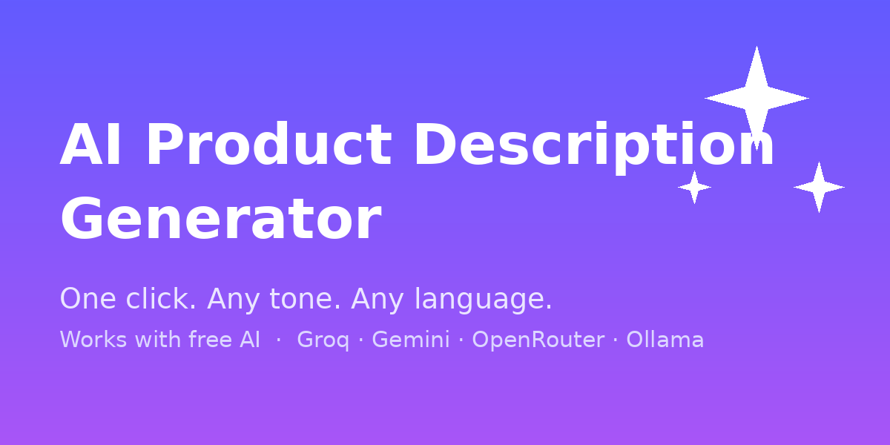

# AI Product Description Generator for Odoo

Generate high-converting product descriptions in **one click** — in any tone and any
language — using the AI provider of your choice, **including free ones**.

> Odoo module · works with OpenAI, **Groq (free)**, **Google Gemini (free)**,
> **OpenRouter (free)**, Anthropic (Claude), and **Ollama (local, free)**.

---

## ✨ Features

- 🪄 **One-click generation** — an *AI Description* button on every product.
- 🎯 **Tone control** — professional, friendly, persuasive, luxury, technical, playful.
- 📏 **Length control** — short, medium, or long.
- 🌍 **Any language** — generate descriptions in the language you sell in.
- 🏷️ **Your keywords** — emphasize the selling points that matter.
- 👀 **Review before applying** — nothing is overwritten until you confirm.
- 🛒 Apply to the **Sales Description** or the **eCommerce (website) description**.
- 🔌 **Multi-provider** — pick paid quality or a **100% free** setup.

## 💸 Use it for free

You do **not** need a paid AI subscription. Any of these work out of the box:

| Provider | Cost | Get a key |
|---|---|---|
| **Groq** | Free API key, very fast | <https://console.groq.com/keys> |
| **Google Gemini** | Generous free tier | <https://aistudio.google.com/apikey> |
| **OpenRouter** | Free models available | <https://openrouter.ai/keys> |
| **Ollama** | 100% local, no key | <https://ollama.com> |
| OpenAI / Anthropic | Paid (premium quality) | provider dashboard |

### 🔑 How to get a FREE API key (step by step)

**Option A — Groq (recommended: free + very fast)**

1. Go to <https://console.groq.com/keys> and sign in (Google/GitHub login works).
2. Click **Create API Key**, give it any name, and **copy** the key (starts with `gsk_...`).
3. In Odoo: **Settings → AI Product Description**.
4. Set **Provider = Groq (free API key)**, paste the key into **API Key**, and **Save**.
5. Leave **Model** empty (defaults to `llama-3.3-70b-versatile`) and you're ready.

**Option B — Google Gemini (generous free tier)**

1. Go to <https://aistudio.google.com/apikey> and sign in with your Google account.
2. Click **Create API key** and **copy** it.
3. In Odoo: **Settings → AI Product Description**.
4. Set **Provider = Google Gemini (free tier)**, paste the key, and **Save**.
5. Leave **Model** empty (defaults to `gemini-2.0-flash`).

**Option C — OpenRouter (access many free models)**

1. Go to <https://openrouter.ai/keys>, sign in, and **Create Key**.
2. In Odoo set **Provider = OpenRouter**, paste the key, **Save**. A free model is used by default.

**Option D — Ollama (100% local, no key, no internet)**

1. Install Ollama from <https://ollama.com> and run a model: `ollama pull llama3.1`.
2. In Odoo set **Provider = Ollama (local, free, no key)** — no API key needed.
3. If Odoo runs in Docker, set **API Base URL** to reach your host (e.g. `http://host.docker.internal:11434`).

> 💡 That's it — open any product, click **AI Description**, choose a tone, and hit **Generate**.

## 🚀 Installation

1. Copy the `ai_product_description` folder into your Odoo `addons` path.
2. Update the apps list and install **AI Product Description Generator**.
3. Go to **Settings → AI Product Description**, pick a provider, and paste your API key.
4. Open any product and click **AI Description**.

## ⚙️ Configuration

**Settings → AI Product Description:**

- **Provider** — choose your AI provider.
- **API Key** — paste your key (not needed for Ollama).
- **Model** — leave empty for a sensible default per provider.
- **API Base URL** — advanced; override only for custom endpoints/proxies.
- **Creativity** — 0 (precise) → 1 (creative).

## 🔒 Privacy

Your product data is sent only to the AI provider **you** select. Nothing is routed
through any other third-party service.

## 🧩 Supported Odoo versions

| Version | Branch |
|---|---|
| Odoo 19 | [`19.0`](../../tree/19.0) |
| Odoo 18 | [`18.0`](../../tree/18.0) |
| Odoo 17 | [`17.0`](../../tree/17.0) |

## 📄 License

[LGPL-3](LICENSE)

## 👤 Author

**Zarki** — Software Engineer · Odoo Developer
